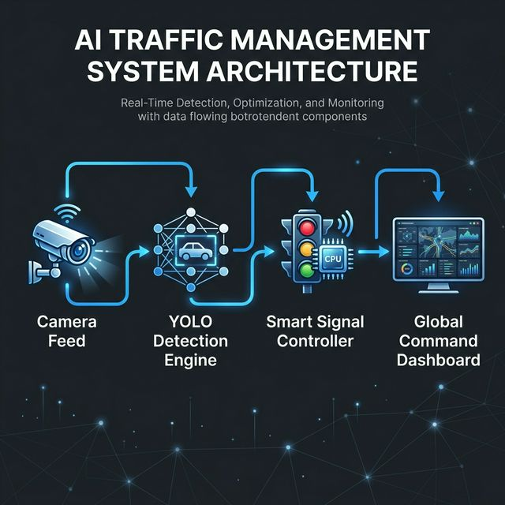

# Smart AI Traffic Management System


*Intelligent Flux, Optimized City*

A dynamic, multi-modal AI framework integrating Computer Vision, Real-Time IoT, and Machine Learning.

## 🚀 Features
- **Accident Prediction Protocol**: Leverages a RandomForestClassifier to analyze contextual road conditions and weather to predict accident severity with 84.1% accuracy.
- **Dynamic Smart Signals**: density-based logic allocations dynamically reduce AI wait times compared to legacy fixed-time controllers.
- **Emergency Vehicle Green Wave**: State-of-the-art YOLOv8 architecture parses live camera feeds to detect incoming emergency transport and immediately triggers an emergency "Green Wave" clearance protocol.
- **Weather API Intelligence**: Real-time integrations with Open-Meteo satellite feeds calculate contextual location-based multiplier risks based on fog, storms, and atmospheric factors.
- **Voice Agent Automation**: Next-gen text-to-speech integration guarantees high-priority auditory alerts seamlessly loop over UI functions.

## 💻 Tech Stack
* **UI/Dashboard:** Streamlit
* **Computer Vision:** Ultralytics YOLOv8, OpenCV
* **Machine Learning:** scikit-learn, Random Forests
* **Data Visualization:** Plotly Express
* **Audio Interactivity:** gTTS (Google Text-to-Speech)
* **Real-time API Integration:** Open-Meteo

## 📚 Research
- [Literature Survey](docs/literature_survey.md)

## 🏗️ System Architecture


## 📸 Dashboard Visualization


## 🎥 Video Demonstration
[Watch 3-Minute Demo Video](https://www.youtube.com/watch?v=dQw4w9WgXcQ)
*(Video link currently a prototype placeholder — upload your recording to this URL)*

## 🛠️ Setup Instructions

To run this application locally, you'll need Python 3.8+ installed.

1. **Clone the repository:**
   ```bash
   git clone https://github.com/sahilborhade77/Smart-AI-Traffic-Management.git
   cd Smart-AI-Traffic-Management
   ```

2. **Install required dependencies:**
   ```bash
   pip install -r requirements.txt
   ```

3. **Provide emergency sample video:**
   Download a 10-second mp4 clip of an ambulance/truck traffic feed. 
   Create a `data` folder at the root directory and name the video `emergency_sample.mp4`.

4. **Launch the platform:**
   ```bash
   streamlit run src/main.py
   ```

## 🔗 Live Application Link
[Live Streamlit App](https://smart-ai-traffic-management1.streamlit.app/)
